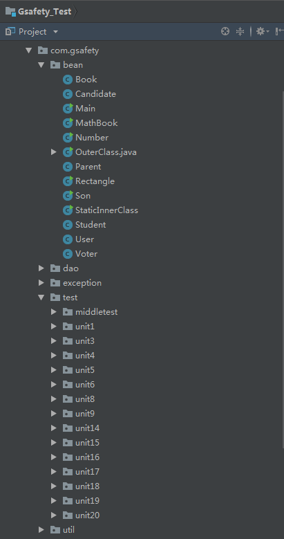

# 作业提交说明

## 文件结构

* 根目录包含三个文件

  >1. 开发项目工程文件：`IntelliJWorkspace`
  >1. 任务完成期间学习日志及截图：`Learning_Log`
  >1. 本说明文档：`0515作业提交说明`

## 关于Git版本控制

* 5月14日开始将SVN版本管理库全部转移到Git版本管理库

* [点击进入GitHub线上资料库查看](https://github.com/MecanZhou/GsafetyTest)

## Java实践与练习说明

* 由于0510作业提交之前，本人在Java工程类包的命名习惯为按Java类属性命名，如实体类会放在`com.gsafety.bean`包内，练习作业实现类则都放在`com.gsafety.test`包内，所有后来要求以单元分类后，部分单元的习题里类属性原因，没有归在以`unit`命名的包内，但所有单元的任务均以完成；

  

* 0510作业提交之后开始完成第19、20章节内容，由于第17、18章实践与练习已于0510之前完成，所以后期重新完成了17、18章增补练习，第十七章以前内容学习日志在0510之前

* 第19章网络通信章节开发了一个`基于TCP的Socket聊天室`和一个`基于UDP的多播系统`，虽然与实践与练习题目不相符，但内容涵盖了题目的要求，且多播系统结合了多线程

  * [点击查看15章学习日志](Learning_Log0505.md)
  * [点击查看16章学习日志](Learning_Log0506.md)
  * [点击查看17/18章学习日志](Learning_Log0515.md)
  * [点击查看19/20章学习日志](Learning_Log0512.md)

## Java中期检测项目

* 项目可执行类在工程的`com.gsafety.test.middletest`包内
* 项目的说明文档可查看[《Java投票器项目说明文档》](Learning_Log0514.md)