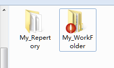
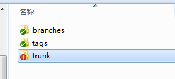
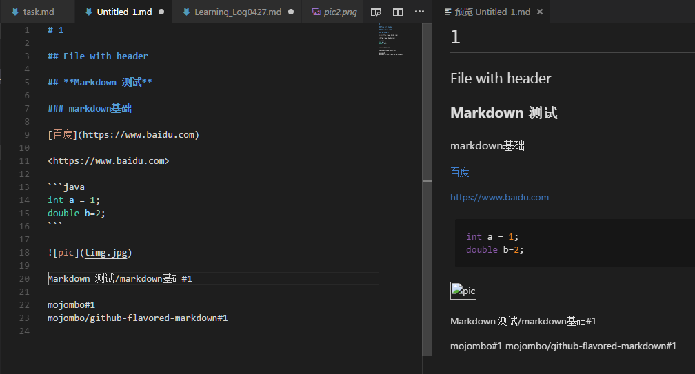
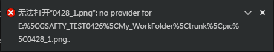

# 0427学习日志

## 环境搭建

* 下载VisualSrudioCode工具，作为Markdown学习环境
  * 安装Markdown all in one 、MarkdownLint插件
* 下载TortoiseSVN版本管理工具，作为版本控制工具
  * 建立本地服务器库My_Repertory以及工作文件夹My_Folder

    
  * 建立服务器库默认文档结构，并导入到工作文件夹

    

* 学习中的问题：

>* 下载vscode以后安装markdown相关插件需要扫描Git相关文件

## Markdown以及TortoiseSVN学习

* 查看Github提供的官方GFM风格说明文档，建立`Untitled-1.md`文本进行相关格式测试

* 在本地工作文件夹中做文件导入导出测试

* 学习中的问题

>1. 在markdown中插入图片，用vscode预览功能无法显示；
>1. markdown的Issue references功能不知道如何使用；
>1. markdown提供的表情功能在vscode中无法预览；
>1. markdown绝对路径不对应问题；
>1. 在提交本地工作文件夹到SVN库中时忘记写提交日志；

## 用markdown的Table功能制作学习计划表

[学习计划表](./学习计划表_周茂根.md)