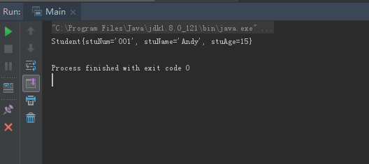

# 0428学习日志

## **1.安装配置IntelliJ IDEA 社区版开发环境**

* 前往官网下载IntelliJ IDEA 2018社区版
* 配置IDE相关环境，指定开发SDK
* 创建Java工程，通过官方说明文档测试软件开发特性
  * java工程的创建，包和类的初始化
  * IDE开发快捷键使用（包括快速创建构造方法，getter/setter方法，利用基础快速代码联想等）

### **Student测试类**

```java
package com.gsafety.bean;

public class Student {
    private String stuNum ;
    private String stuName ;
    private int stuAge ;

    @Override
    public String toString() {
        return "Student{" +
                "stuNum='" + stuNum + '\'' +
                ", stuName='" + stuName + '\'' +
                ", stuAge=" + stuAge +
                '}';
    }

    public String getStuNum() {
        return stuNum;
    }

    public void setStuNum(String stuNum) {
        this.stuNum = stuNum;
    }

    public String getStuName() {
        return stuName;
    }

    public void setStuName(String stuName) {
        this.stuName = stuName;
    }

    public int getStuAge() {
        return stuAge;
    }

    public void setStuAge(int stuAge) {
        this.stuAge = stuAge;
    }

    public Student(String stuNum, String stuName, int stuAge) {
        this.stuNum = stuNum;
        this.stuName = stuName;
        this.stuAge = stuAge;
    }
}
```

### **测试实现类**

```java
package com.gsafety.bean;

public class Main {

    public static void main(String[] args) {
    // write your code here
        Student student_1 = new Student("001","Andy", 15);
        System.out.println( student_1.toString());

    }
}
```

### **实现类控制台输出**

]

## **2.学习计划表制作**

点击查看[学习计划表](./学习计划表_周茂根.md)