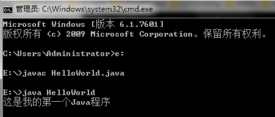
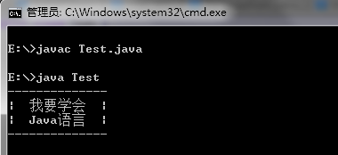
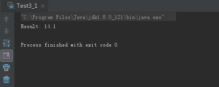
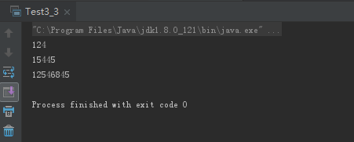

# **0429学习日志**

## 第一章 初识Java

### **实践与练习（1_1、1_2）**

* **使用cmd命令编译并运行java文件**

  ```java
  public class HelloWorld {
    public static void main(String[] args) {
        System.out.println("这是我的第一个Java程序");
    }
  }
  ```

  运行结果:

  

* **指定结果输出**

  ```java
  public class Test {
    public static void main(String[] args) {
        System.out.println("--------------");
        System.out.println("|  我要学会  |");
        System.out.println("|  Java语言  |");
        System.out.println("--------------");
    }
  }
  ```

  运行结果：

  

## 第三章 Java语言基础

### **实践与练习（3_1、3_3）**

* **将两个数相加结果并输出**

  ```java
  public class Test3_1 {
    public static void main(String[] args) {
        int a = 5;
        double b = 9.1;
        double res = a + b;
        System.out.println("Result: " + res);
    }
  }
  ```

  运行结果：

  

* **将所有整型数值转化为int型并输出**

  ```java
  public class Test3_3 {
    public static void main(String[] args) {
        byte mybyte = 124;//声明byte型变量并赋值
        short myshort = 15445;//声明short型变量并赋值
        long mylong = 12546845;//声明long型变量并赋值

        //将所有整形数值转化为int并输出
        int byteToInt = mybyte;
        int shortToInt = myshort;
        int longToInt = (int)mylong;

        System.out.println(byteToInt);
        System.out.println(shortToInt);
        System.out.println(longToInt);
    }
  }
  ```

  运行结果：

  

## **总结**

>* Java语言在控制台编译并运行后中文乱码问题：将文本保存为ANSI编码格式；
>* IntelliJ中main方法快捷键不同于eclipse，为psvm，输出为sout；
>* 整数类型数据类型有byte、short、int、long，储存空间分别为8、16、32、64位；