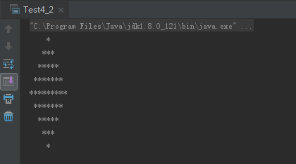
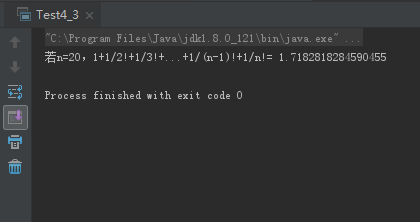
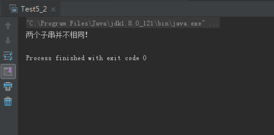
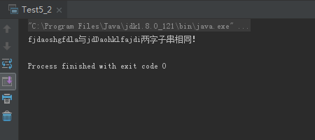
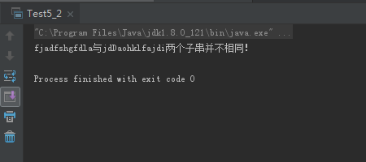
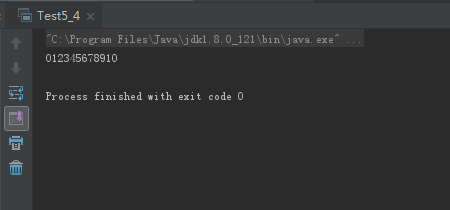

# **0430学习日志**

## 第四章 流程控制

### **实践与练习（4_2、4_3）**

* **用循环控制实现控制台输出菱形**

  ```java
  /**
  * 用循环控制实现控制台输出菱形
  */
  public class Test4_2 {
    public static void main(String[] args) {
        int n = 5;//控制菱形对角线长度
        //输出菱形上半部分
        for (int i = 1; i <= n; i++) {
            for (int j = n - 1; j >= i; j--) {
                System.out.print(" ");//缺省打印空格
            }
            for (int k = 1; k <= 2 * i - 1; k++) {
                System.out.print("*");//打印*填充菱形
            }
            System.out.println();//打印一行后换行
        }
        //输出菱形下半部分
        for (int i = n - 1; i >= 1; i--) {
            for (int j = i; j <= n - 1; j++) {
                System.out.print(" ");
            }
            for (int k = 1; k <= 2 * i - 1; k++) {
                System.out.print("*");
            }
            System.out.println();
        }
    }
  }
  ```

  运行结果:

  

* **计算1+1/2!+1/3!+...+1/20!并输出结果**

  ```java
  /**
  * 计算1+1/2!+1/3!+...+1/20!并输出结果
  */

  public class Test4_3 {
    public static void main(String[] args) {
        int n = 20;//指定算数阶乘最大值
        double sum = 0;
        //控制+运算
        for (double i = 1; i <= n; i++) {
            double s = 1;
            //控制*运算
            for (double j = 1; j <= i; j++) {
                s*=j;
            }
            sum+=1/s;
        }
        System.out.println("若n=20，1+1/2!+1/3!+...+1/(n-1)!+1/n!= "+ sum);
    }
  }
  ```

  运行结果:

  

## 第五章 字符串

### **实践与练习（5_2、5_4）**

* **判断字符串子串忽略大小写后是否相同**

  ```java
  public class Test5_2 {
    public static void main(String[] args) {
        String str1 = "fjdoashgfdla";
        String str2 = "jdfadhklfajdi";

        if (str1.substring(2,4).equalsIgnoreCase(str2.substring(2,4))){
            System.out.println("两字子串相同！");
        }else {
            System.out.println("两个子串并不相同！");
        }
    }
  }
  ```

  运行结果:

  
  
  

* **使用字符串生成器追加1~10**

  ```java
  public class Test5_4 {

    public static void main(String[] args) {
        StringBuilder stringBuilder = new StringBuilder("");
        for (int i = 0; i <= 10; i++) {
            stringBuilder.append(i);
        }
        System.out.println(stringBuilder);
    }
  }
  ```

  运行结果:

  