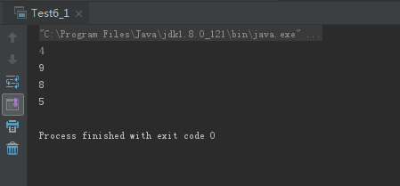
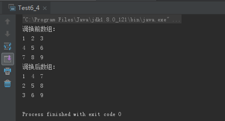
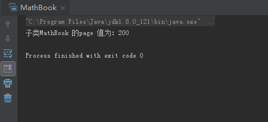
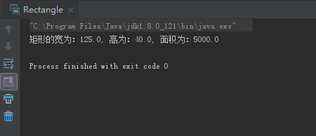

# 0501学习日志

## 第六章 数组

### **实践与练习（6_1、6_4）**

* **复制数组指定元素**

  ```java
  import java.util.Arrays;

  public class Test6_1 {
    public static void main(String[] args) {
        int[] arr1 = new int[]{4,9,8,5,6};
        int[] arr2 = Arrays.copyOfRange(arr1,0,4);
        for (int a:arr2 ) {
            System.out.println(a);
        }
    }
  }
  ```

  运行结果:

  

* **调换二维数组元素**

  ```java
  public class Test6_4 {

    public static void main(String[] args) {
        int[][] arr1 = new int[][]{{1,2,3},{4,5,6},{7,8,9}};
        System.out.println("调换前数组：");
        for (int i = 0; i < arr1.length; i++) {
            for (int j = 0; j < arr1[i].length; j++) {
                System.out.print(arr1[i][j]+"  ");
            }
            System.out.println();
        }

        int[][] arr2 = new int[3][3];
        for (int i = 0; i < arr1.length; i++) {
            for (int j = 0; j < arr1[i].length; j++) {
                arr2[j][i]=arr1[i][j];
            }
        }
        System.out.println("调换后数组：");
        for (int i = 0; i < arr2.length; i++) {
            for (int j = 0; j < arr2[i].length; j++) {
                System.out.print(arr2[i][j]+"  ");
            }
           System.out.println();
        }
    }
  }
  ```

  运行结果:

  

## 第七章 类和对象

### **实践与练习（7_1、7_2）**

* **子类调用父类方法**
  * 父类代码

  ```java
  package com.gsafety.bean;

  public class Book {

    private int bookPage;

    public Book() {
    }

    public int getBookPage() {
        return bookPage;
    }

    public void setBookPage(int bookPage) {
        this.bookPage = bookPage;
    }

    public Book(int bookPage) {

        this.bookPage = bookPage;
    }
  }
  ```

  * 子类代码

  ```java
    package com.gsafety.bean;

    public class MathBook extends Book{

      public static void main(String[] args) {

        MathBook mathBook = new MathBook();
        mathBook.setBookPage(200);
        System.out.println("子类MathBook 的page 值为："+mathBook.getBookPage());
      }
    }
  ```

  运行结果:

  

  * **计算矩形面积**

  ```java
  package com.gsafety.bean;

  public class Rectangle {

    private double width;
    private double height;

    public double getWidth() {
        return width;
    }

    public void setWidth(double width) {
        this.width = width;
    }

    public double getHeight() {
        return height;
    }

    public void setHeight(double height) {
        this.height = height;
    }

    public Rectangle(double width, double height) {
        this.width = width;
        this.height = height;
    }

    public double getArea(){
        return this.height*this.width;
    }

    public static void main(String[] args) {
        Rectangle r= new Rectangle(125,40);
        System.out.println("矩形的宽为："+r.width+", 高为："+r.height+", 面积为："+ r.getArea());
    }
  }
  ```

  运行结果:

  