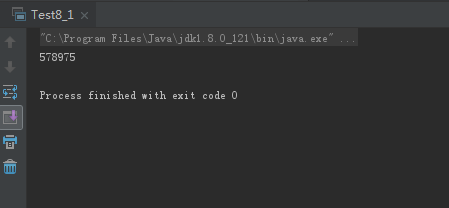
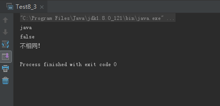
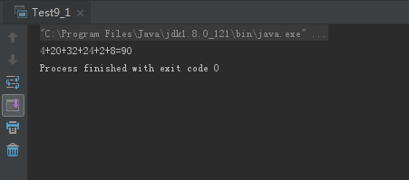
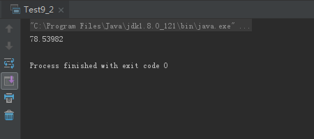

# 0502学习日志

## 第八章 包装类

### **实践与练习（8_1、8_3）**

* **Integer包装类转int**

  ```java
  package com.gsafety.test;

  public class Test8_1 {
    public static void main(String[] args) {
        Integer num = new Integer(578975);
        int num1 = num.intValue();
        System.out.println(num1);
    }
  }
  ```

  运行结果:

  

* **Boolean类**

  ```java
  package com.gsafety.test;

  public class Test8_3 {

    public static void main(String[] args) {
        String str1 = "java";
        Boolean b = new Boolean(str1);
        String str2  = b.toString();
        System.out.println(str1);
        System.out.println(str2);
        if (!str1.equals(str2)){
            System.out.println("不相同！");
        }
    }
  }
  ```

  运行结果:

  

## 第九章 数字处理类

### **实践与练习（9_1、9_2）**

* **随机数产生2~32以内的六个偶数相加**

  ```java
  package com.gsafety.test;

  public class Test9_1 {

    public static int GetNum(int num1, int num2){
        int s = num1 + (int)(Math.random()*(num2-num1));
        if (s%2==0){
            return s;
        }else {
            return s+1;
        }
    }

    public static void main(String[] args) {
        int sum = 0;
        for (int i = 0; i < 6; i++) {
            int s = GetNum(2,32);
            if (i!=5) {
                System.out.print(s + "+");
            }else {
                System.out.print(s);
            }
            sum+=s;
        }
        System.out.print("="+sum);
    }
  }
  ```

  运行结果:

  

* **格式化输出数据保留五位小数**

  ```java
  package com.gsafety.test;

  import java.text.DecimalFormat;

  public class Test9_2 {

    public static String GetArea(double r){
        DecimalFormat myFormat = new DecimalFormat("###.00000");
        return myFormat.format(Math.PI*(r*r));
    }

    public static void main(String[] args) {
        String res = GetArea(5);
        System.out.println(res);
    }
  }
  ```

  运行结果:

  