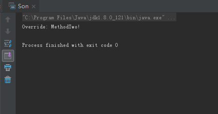
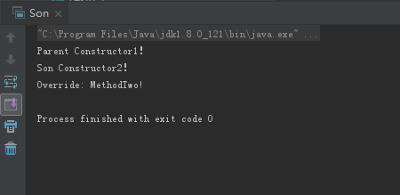
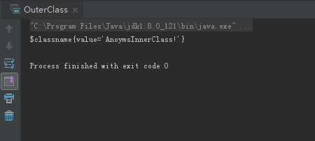
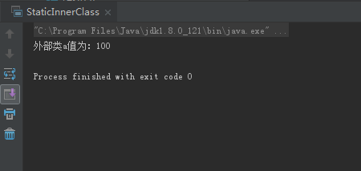

# 0503学习日志

## 第十章 接口、继承与多态

### **实践与练习（10_2、10_3）**

* **覆盖基类方法，向上转型后调用**
  * 基类Parent类

  ```java
  package com.gsafety.bean;

  public class Parent {

    private String name;

    public Parent(String name) {
        this.name = name;
        System.out.println("Parent Constructor2！");
    }

    public Parent() {
        System.out.println("Parent Constructor1！");
    }

    public void methodOne(){
        System.out.println("Parent:MethodOne!");
    }

    public void methodTwo(){
        System.out.println("Parent:MethodTwo!");
    }
  }
  ```

  * 子类Son类

  ```java
  package com.gsafety.bean;

  public class Son extends Parent {

    private String name;

    public Son() {
        System.out.println("Son Constructor1！");
    }

    public Son(String name) {
        this.name = name;
        System.out.println("Son Constructor2！");
    }

    @Override
    public void methodTwo() {
        System.out.println("Override: MethodTwo!");
    }

    public static void main(String[] args) {
        Son s  = new Son("Mecan");
        Parent p = s;
        p.methodTwo();
    }
  }
  ```

  * 运行结果:

  

* **总结构建子类对象时的顺序**

  * 代码同上

  * 运行结果:

  

  * **总结**

  构建子类对象时，首先运行父类默认的构造方法，然后运行子类构造方法。

## 第十一章 类的高级特性

### **实践与练习（11_1、11_3）**

* **在方法中编写匿名内部类**

  ```java
  package com.gsafety.bean;

  interface AnoymsInnerClass{
  }

  public class OuterClass {
    public AnoymsInnerClass doit(){
        return new AnoymsInnerClass(){

           private String value = "AnoymsInnerClass!";

            public String getValue() {
                return value;
            }

            @Override
            public String toString() {
                return "$classname{" +
                        "value='" + value + '\'' +
                        '}';
            }
        };
    }

    public static void main(String[] args) {
        OuterClass o = new OuterClass();
        System.out.println(o.doit().toString());
    }
  }
  ```

  * 运行结果:

  

* **在类中定义静态内部类**

  ```java
  package com.gsafety.bean;

  public class StaticInnerClass {

    static int a = 100;
    static class Inner{
        public void doit(){
            System.out.println("外部类a值为："+a);
        }
    }

    public static void main(String[] args) {
        Inner inner = new Inner();
        inner.doit();
    }
  }
  ```

  * 运行结果:

  