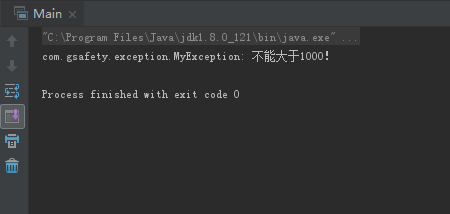

# 0504学习日志

## 第十二章 异常处理

### **实践与练习（12_1、12_2）**

* **自定义异常类抛出并捕获**
  * 自定义异常类MyException

  ```java
  package com.gsafety.exception;

  public class MyException extends Exception {
    private String msc;
    public MyException(String msc) {
       super(msc);
    }
    public String getMsc() {
        return msc;
    }
  }
  ```

  * 抛出异常类的Student类的方法speak

  ```java
  public String speak(int m) throws MyException {
        if (m>1000){
            throw new MyException("不能大于1000！");
        }
        return "Speak方法被执行！";
    }
  ```

  * 运行结果:

  

* **Number类的count方法添加try-catch块**

  ```java
  package com.gsafety.bean;

  public class Number {

    public double count(double x, double y){
        return x*y;
    }

    public static void main(String[] args) {
        Number n = new Number();
        double res = 0;
        try {
            res = n.count(455,(9/0));
        }catch (Exception e){
            e.printStackTrace();
        }
        System.out.println("Result:"+res);
    }
  }
  ```

  * 运行结果:

  

## 第十四章 集合类

### **实践与练习（14_1、14_2）**

* **向List集合中添加并删除数字**

  ```java
  package com.gsafety.test;

  import java.util.Iterator;
  import java.util.LinkedList;
  import java.util.List;

  public class Test14_1 {

    public static void main(String[] args) {
        List<Integer> list = new LinkedList<>();
        for (int i = 0; i < 100; i++) {
            list.add(i+1);
        }
        list.add(9);
        System.out.println("此时集合list中包含以下元素：");
        for (int i = 0; i < list.size(); i++) {
            System.out.print(list.get(i)+" ");
            if (list.get(i)%10==0)
                System.out.println();
        }
        System.out.println();
        list.remove(10);
        System.out.println("删除索引位置为10的值后，集合list中包含以下元素：");
        for (int i = 0; i < list.size(); i++) {
            System.out.print(list.get(i)+" ");
            if (list.get(i)%10==0)
                System.out.println();
        }
    }
  }

  ```

  * 运行结果:

  

* **观察List集合与Set集合添加元素区别**
  * 观察结果：在List类中可重复性添加元素'a'，但在Set集合中不允许重复。