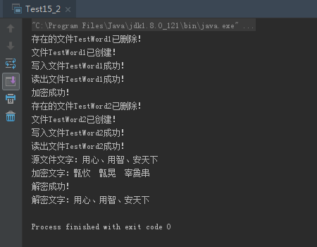
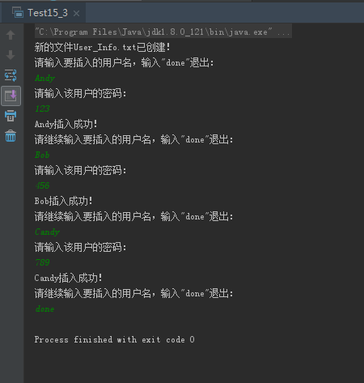
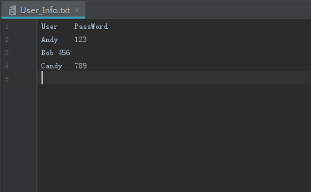

# 0505学习日志

## 第十五章 I/O(输入、输出)

### **实践与练习（15_2、15_3）**

* **将一段文字存入文件，加密后存入另一个文件，输出两个文件信息**

  ```java
  package com.gsafety.test;

  import java.io.*;

  public class Test15_2 {

    //定义密匙
    private final char KEY = '9';

     //将文字写入文件
    public boolean strToFile(String str, File f){
        if (f.exists()){
            f.delete();
            System.out.println("存在的文件"+f.getName()+"已删除！");
        }
        try {
            f.createNewFile();
            System.out.println("文件"+f.getName()+"已创建！");
        } catch (IOException e) {
            e.printStackTrace();
        }
        try {
            FileWriter fw = new FileWriter(f);
            fw.write(str);
            fw.close();
            System.out.println("写入文件"+f.getName()+"成功！");
            return true;
        } catch (IOException e) {
            e.printStackTrace();
        }
        return false;
    }

    //读出文件中的文字
    public String fileToStr(File file){
        try {
            FileReader fr = new FileReader(file);
            char[] byt = new char[1024];
            int len = fr.read(byt);
            System.out.println("读出文件"+file.getName()+"成功！");
            return new String(byt,0,len);
        } catch (FileNotFoundException e) {
            e.printStackTrace();
        } catch (IOException e) {
            e.printStackTrace();
        }
        return null;
    }

    //将文字加密
    public String encodeStr(String str){
        StringBuffer sb = new StringBuffer(str);
        StringBuffer res = new StringBuffer();
        for(int i=0;i<str.length();i++)
        {
            char c = (char)(str.charAt(i) ^ KEY);
            res.append(c);
         }
        System.out.println("加密成功！");
         return res.toString();
    }

    //将文字解密
    public String decodeStr(String str){
        StringBuffer sb = new StringBuffer(str);
        StringBuffer res = new StringBuffer();
        for(int i=0;i<str.length();i++)
        {
            char c = (char)(str.charAt(i) ^ KEY);
            res.append(c);
        }
        System.out.println("解密成功！");
        return res.toString();
    }

    public static void main(String[] args) {
        String str = "用心、用智、安天下";
        Test15_2 t = new Test15_2();
        File f = new File("TestWord1");
        if (t.strToFile(str , f)){
            String str2 = t.fileToStr(f);
            File f2 = new File("TestWord2");
            if (t.strToFile(t.encodeStr(str2),f2)){
                String str3 = t.fileToStr(f2);
                System.out.println("源文件文字："+str2);
                System.out.println("加密文字："+str3);
                System.out.println("解密文字："+t.decodeStr(str3));
            }
        }

    }
  }
  ```

  * 运行结果:

  

* **将控制台输入的用户名密码存入到文件中**

  ```java
  package com.gsafety.test;

  import java.io.*;

  public class Test15_3 {

    public static void main(String[] args) {
        File file = new File("User_Info.txt");
        if(file.exists()){
            file.delete();
            System.out.println("存在的文件"+file.getName()+"已删除！");
        }
        try {
            file.createNewFile();
            System.out.println("新的文件"+file.getName()+"已创建！");
            FileWriter fw = new FileWriter(file);
            BufferedWriter bw = new BufferedWriter(fw);
            bw.write("User\tPassWord");
            bw.newLine();
            //bw.flush();
            BufferedReader br= new BufferedReader(new InputStreamReader(System.in));
            System.out.println("请输入要插入的用户名，输入\"done\"退出：");
            String str = br.readLine();
            while(!str.equalsIgnoreCase("done")){
                bw.write(str+"\t");
                System.out.println("请输入该用户的密码：");
                String str2 = br.readLine();
                bw.write(str2);
                bw.newLine();
                System.out.println(str+"插入成功！\n请继续输入要插入的用户名，输入\"done\"退出：");
                str = br.readLine();
                bw.flush();
            }
            br.close();
            bw.close();
        } catch (IOException e) {
            e.printStackTrace();
        }
    }
  }
  ```

  * 运行结果:

   
   

### **总结**

>* 新建文件前注意文件是否存在于磁盘中
>* 在接收控制台输入字符时可用如下代码：

```java
BufferedReader br= new BufferedReader(new InputStreamReader(System.in));
String str = br.readLine();
```
