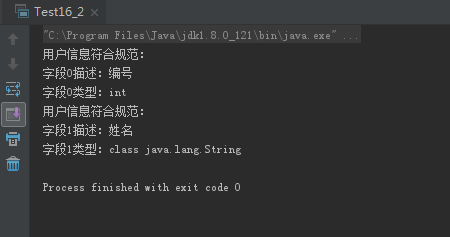

# 0506学习日志

## 第十六章 反射

### **实践与练习（16_1、16_2）**

* **利用反射实现通用数组长度扩展**

  ```java
  package com.gsafety.test;

  import java.lang.reflect.Array;

  public class Test16_1 {

    //扩展数组长度
    public Object extendArray(Object obj, int newLength){
        Class c = obj.getClass();
        if (!c.isArray()){
            System.out.println("要扩展的不是一个数组！");
            return null;
        }
        Class componentType = c.getComponentType();
        int length = Array.getLength(obj);
        Object newArray = Array.newInstance(componentType,newLength);
        System.arraycopy(obj, 0, newArray, 0, Math.min(length, newLength));

        return newArray;
    }

    //打印数组
    public void printArray(Object obj){
        Class c = obj.getClass();
        if (!c.isArray()){
            System.out.println("要打印的不是一个数组！");
            return;
        }
        System.out.println("当前数组"+c.getName()+"长度为："+Array.getLength(obj));
        for (int i = 0; i < Array.getLength(obj); i++) {
            System.out.print(Array.get(obj,i)+" ");
        }
        System.out.println();
    }

    //测试主函数
    public static void main(String[] args) {
        Test16_1 t = new Test16_1();
        double[] doubles = new double[]{88.6, 6.23, 5.06};
        //打印原始数组
        t.printArray(doubles);
        //扩展数组
        Object newArray = t.extendArray(doubles,10);
        t.printArray(newArray);
    }
  }
  ```

  * 运行结果:

  

* **用反射实现初步验证用户输入信息**
  * Annotation接口

  ```java
  package com.gsafety.util;

  import java.lang.annotation.ElementType;
  import java.lang.annotation.Retention;
  import java.lang.annotation.RetentionPolicy;
  import java.lang.annotation.Target;

  @Target(ElementType.FIELD)
  @Retention(RetentionPolicy.RUNTIME)
  public @interface Field_Annotation {
    //用于字段
    String describe() default "<Default>";
    Class type() default void.class;
  }
  ```

  * User类配置Annotation

  ```java
  package com.gsafety.bean;

  import com.gsafety.util.Field_Annotation;

  public class User {
    //注释字段
    @Field_Annotation(describe = "编号", type = int.class)
    private int userId;
    @Field_Annotation(describe = "姓名", type = String.class)
    private String userName;

    public User(int userId, String userName) {
        this.userId = userId;
        this.userName = userName;
    }

    public int getUserId() {
        return userId;
    }

    public void setUserId(int userId) {
        this.userId = userId;
    }

    public String getUserName() {
        return userName;
    }

    public void setUserName(String userName) {
        this.userName = userName;
    }
  }
  ```

  * 主测试类

  ```java
  package com.gsafety.test;

  import com.gsafety.bean.User;
  import com.gsafety.util.Field_Annotation;

  import java.lang.reflect.Field;

  public class Test16_2 {

    //判断用户信息是否符合规范

    public static void main(String[] args) {
        User user = new User(1, "Andy");
        Class userC = user.getClass();
        Field[] declaredFields = userC.getDeclaredFields();
        for (int i = 0; i < declaredFields.length; i++) {
            Field field = declaredFields[i];
            field.setAccessible(true);
            if (field.isAnnotationPresent(Field_Annotation.class)){
                System.out.println("用户信息符合规范：");
                Field_Annotation fa = field.getAnnotation(Field_Annotation.class);
                System.out.println("字段"+i+"描述："+fa.describe());
                System.out.println("字段"+i+"类型："+fa.type());
            }else {
                System.out.println("用户信息不符合规范！");
            }
        }
    }
  }
  ```

  * 运行结果:

   

### **总结**

>实际项目中应该从前端界面获取输入信息进行测试
