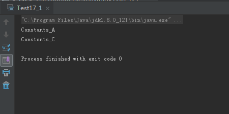
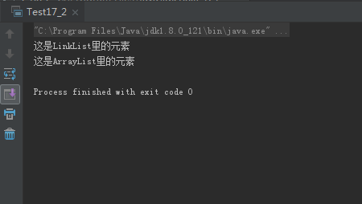

# 0507学习日志

## 第十七章 枚举类型

### **实践与练习（17_1、17_2）**

* **定义枚举类型，用switch语句获取类型值**

  * 枚举类型Constants

  ```java
  package com.gsafety.util;

  public enum Constants {
    Constants_A, Constants_B,Constants_C;
  }
  ```

  * 测试主类

  ```java
  package com.gsafety.test;

  import com.gsafety.util.Constants;

  public class Test17_1 {

    public static void getEnum(Constants c){
        switch (c){
            case Constants_A:
                System.out.println(Constants.Constants_A);
                break;
            case Constants_B:
                System.out.println(Constants.Constants_B);
                break;
            case Constants_C:
                System.out.println(Constants.Constants_C);
                break;
        }
    }

    public static void main(String[] args) {
        Test17_1.getEnum(Constants.Constants_A);
        Test17_1.getEnum(Constants.Constants_C);
    }
  }
  ```

  * 运行结果:

  

* **用extens关键字定义泛型类**

  * 主测试类

  ```java
  package com.gsafety.test;

  import java.util.ArrayList;
  import java.util.LinkedList;
  import java.util.List;

  public class Test17_2<T extends List> {

    private T over;

    public T getOver() {
        return over;
    }

    public void setOver(T over) {
        this.over = over;
    }

    public static void main(String[] args) {
        Test17_2<LinkedList> l1 = new Test17_2<LinkedList>();
        Test17_2<ArrayList> l2 = new Test17_2<ArrayList>();
        LinkedList<String> ll = new LinkedList<String>();
        ArrayList<String> al = new ArrayList<String>();
        l1.setOver(ll);
        l1.getOver().add(0,"这是LinkList里的元素");
        l2.setOver(al);
        l2.getOver().add(0,"这是ArrayList里的元素");
        for (int i = 0; i < ll.size(); i++) {
            System.out.println(ll.get(i));
        }
        for (int i = 0; i < al.size(); i++) {
            System.out.println(al.get(i));
        }
    }
  }
  ```

  * 运行结果:

   

### **总结**

>泛型类有多种用法，包括限制泛型可用类型、使用类型通配符、继承泛型类或泛型接口等
