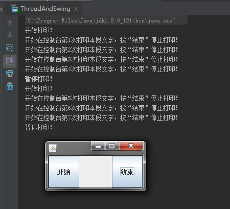
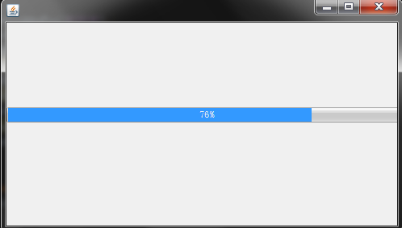

# 0508学习日志

## 第十八章 多线程

### **实践与练习**

* **多线程+Swing实现按钮控制控制台输出**

  * 测试主类

  ```java
  package com.gsafety.test;

  import javax.swing.*;
  import java.awt.*;
  import java.awt.event.ActionEvent;

  public class ThreadAndSwing extends JFrame {

    private Thread thread;
    private JButton jb1 , jb2;
    private static int count = 1;
    private static boolean flag = false;

    public static boolean isFlag() {
        return flag;
    }

    public static void setFlag(boolean flag) {
        ThreadAndSwing.flag = flag;
    }

    public ThreadAndSwing() throws HeadlessException {

        //初始化并添加按钮到面板中
        jb1 = new JButton("开始");
        jb2 = new JButton("结束");

        this.getContentPane().add(jb1,BorderLayout.WEST);
        this.getContentPane().add(jb2,BorderLayout.EAST);

        thread = new Thread(new Runnable() {
            @Override
            public void run() {
               while (true){
                   synchronized ("") {
                       if (isFlag() == true) {
                           System.out.println("开始在控制台第" + count + "次打印本段文字，按“结束”停止打印！");
                           count++;
                           try {
                               Thread.sleep(2000);
                           } catch (InterruptedException e) {
                               e.printStackTrace();
                           }
                       }
                   }
                }
            }
        });
        thread.start();

        jb1.addActionListener(new AbstractAction() {
            @Override
            public void actionPerformed(ActionEvent e) {
                System.out.println("开始打印！");
                setFlag(true);
            }
        });

        jb2.addActionListener(new AbstractAction() {
            @Override
            public void actionPerformed(ActionEvent e) {
                setFlag(false);
                System.out.println("暂停打印！");
            }
        });
    }

    //初始化窗口
    public static void init(JFrame jFrame){
        jFrame.setBounds(500,500,200,100);
        jFrame.setDefaultCloseOperation(JFrame.EXIT_ON_CLOSE);
        jFrame.setVisible(true);
    }

    //主运行类
    public static void main(String[] args) {
        ThreadAndSwing.init(new ThreadAndSwing());
    }
  }
  ```

  * 运行结果:

  

* **多线程实现进度条递增**

  * 主测试类

  ```java
  package com.gsafety.test;

  import javax.swing.*;
  import java.awt.*;

  public class JprogressTest extends JFrame {

    private JPanel jPanel;
    private JProgressBar jProgressBar;
    private Thread thread;
    private static final String METAL = "javax.swing.plaf.metal.MetalLookAndFeel";
    private static final String	MOTIF = "com.sun.java.swing.plaf.motif.MotifLookAndFeel";
    private static final String	NIMBUS = "com.sun.java.swing.plaf.nimbus.NimbusLookAndFeel";
    private static final String WINDOWS = "com.sun.java.swing.plaf.windows.WindowsLookAndFeel";

    public JprogressTest() throws HeadlessException {

        Toolkit kit= Toolkit.getDefaultToolkit();
        Dimension screenSize=kit.getScreenSize();
        int screenWidth=screenSize.width;
        int screenHeight= screenSize.height;

        setSize(screenWidth/2-300, screenHeight/2-160);
        setLocation(screenWidth/2-getWidth()/2, screenHeight/2-getWidth()/2);
        try {
            UIManager.setLookAndFeel(WINDOWS);
        } catch (ClassNotFoundException e) {
            e.printStackTrace();
        } catch (InstantiationException e) {
            e.printStackTrace();
        } catch (IllegalAccessException e) {
            e.printStackTrace();
        } catch (UnsupportedLookAndFeelException e) {
            e.printStackTrace();
        }

        jProgressBar = new JProgressBar();
        jProgressBar.setStringPainted(true);

        jPanel = new JPanel(null);
        getContentPane().add(jPanel,BorderLayout.CENTER);
        jPanel.add(jProgressBar);
        jProgressBar.setBounds(0,this.getHeight()/2-40,this.getWidth(), 20);

        thread = new Thread(new Runnable() {
            int count = 0;
            @Override
            public void run() {
                while (true){
                    jProgressBar.setValue(++count);
                    try {
                        Thread.sleep(100);
                    } catch (InterruptedException e) {
                        e.printStackTrace();
                    }

                }
            }
        });
        thread.start();
    }

    //初始化窗口
    public static void init(JFrame jFrame){

        jFrame.setDefaultCloseOperation(JFrame.EXIT_ON_CLOSE);
        jFrame.setVisible(true);
    }

    public static void main(String[] args) {
        init(new JprogressTest());
    }
  }
  ```

  * 运行结果:

   

### **总结**

>* 线程有七种状态：出生、就绪、执行、睡眠、等待、阻塞、死亡
>* 多线程使用时可用`synchronized ("")`锁保证线程安全
>* Thread类其实是实现了Runnable接口的`run()`方法
