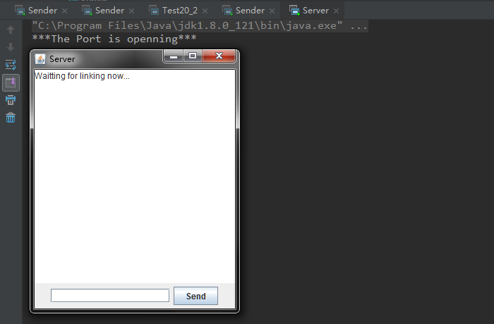
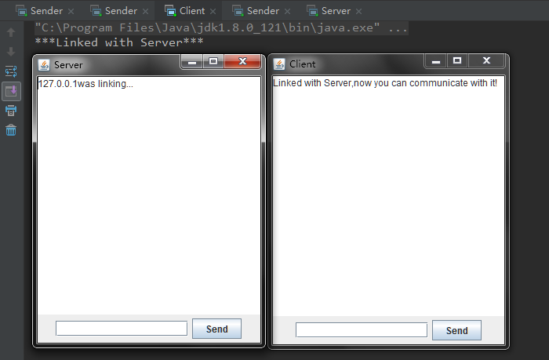
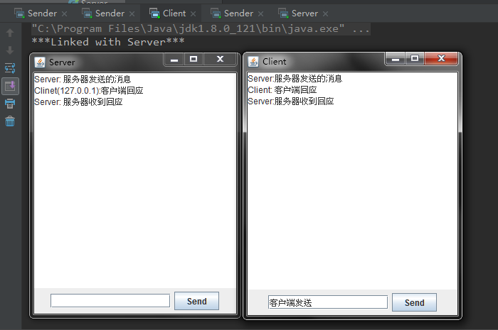
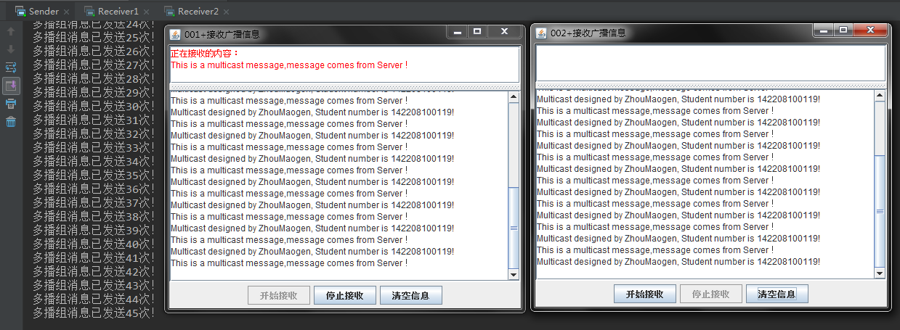
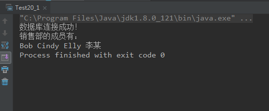
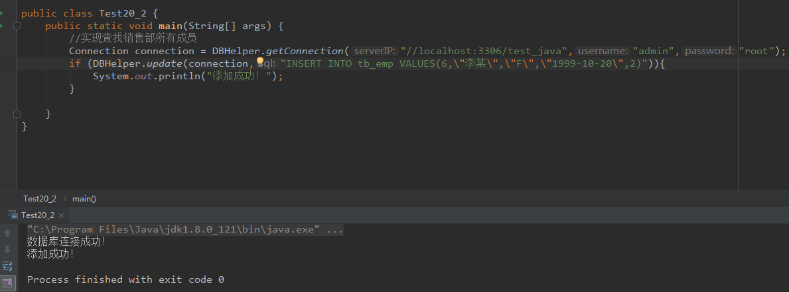
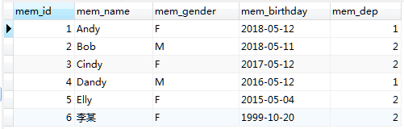

# 0512学习日志

## 第十九章 网络通信

### 实践与练习（TCP聊天室，UDP广播）

* **基于TCP协议的Socket聊天室**

  * 服务器端Server关键代码

  ```java
  try {
            ServerSocket serverSocket = new ServerSocket(8888);
            System.out.println("***The Port is openning***");
            jTextArea.setText("Waitting for linking now...");
            socket=serverSocket.accept();
            System.out.println(socket.getInetAddress().getHostAddress()+"was linking...");
            jTextArea.setText(socket.getInetAddress().getHostAddress()+"was linking...");
        } catch (IOException e) {
            // TODO Auto-generated catch block
            e.printStackTrace();
        }
        while (true) {
            String sstr;

            BufferedReader sis= new BufferedReader(new InputStreamReader(socket.getInputStream()));
            sstr = sis.readLine();
            infoString=infoString+"Clinet("+socket.getInetAddress().getHostAddress()+"):"+sstr+"\n";
            jTextArea.setText(infoString);

  }
  ```

  * 客户端Client关键代码

  ```java
   try {
            socket=new Socket("localhost", 8888);
        } catch (IOException e) {
            e.printStackTrace();
        }
        String socketAdress=socket.getInetAddress().getHostAddress();
        System.out.println("***Linked with Server***");
        jTextArea.setText("Linked with Server,now you can communicate with it!");

        while(true){
            try {
                BufferedReader cis=new BufferedReader(new InputStreamReader(socket.getInputStream()));
                String s=cis.readLine();
                infoString=infoString+"Server:"+s+"\n";
                jTextArea.setText(infoString);
            } catch (IOException e) {
                // TODO Auto-generated catch block
                e.printStackTrace();
            }

        }
  ```

  * 运行结果截图

  

  

  

* **基于UDP的多播系统**

  * 服务器端Sender关键代码

  ```java
  try {
            groupAddress = InetAddress.getByName("230.198.112.0");
            multicastSocket = new MulticastSocket(port);
            multicastSocket.setTimeToLive(1);
            multicastSocket.joinGroup(groupAddress);

    } catch (UnknownHostException e) {
            e.printStackTrace();
    } catch (IOException e) {
            e.printStackTrace();
    }
    //多线程实现广播
    public void run(){
        int count = 0;
        while(true){
            DatagramPacket packet = null;
            for(String msg: message){
                byte buff[] = msg.getBytes();
                packet = new DatagramPacket(buff, buff.length,groupAddress,port);
                try {
                    multicastSocket.send(packet);
                    count++;
                    System.out.println("多播组消息已发送"+count+"次！");
                } catch (IOException e) {
                    e.printStackTrace();
                }
                try {
                    Thread.sleep(1000);
                } catch (InterruptedException e) {
                    e.printStackTrace();
                }
            }
        }
    }
  ```

  * 运行结果截图

  

## 第二十章 数据库操作

### **实践与练习（20_1, 20_2）**

* 数据库连接及查询

  * 关键代码（DBHelper类）实现数据库的连接以及增删改查通用操作

  ```java
  package com.gsafety.util;

  import java.sql.*;

  public class DBHelper {

    /**
     * 连接数据库
     * @param serverIP 数据库连接地址
     * @param username 数据库名
     * @param password 数据库密码
     * @return 数据库连接对象
     */
    public static Connection getConnection(String serverIP, String username, String password){

        Connection connection = null;
        try {
            Class.forName("com.mysql.jdbc.Driver");
        } catch (ClassNotFoundException e) {
            e.printStackTrace();
        }
        try {
            connection = DriverManager.getConnection("jdbc:mysql:"+serverIP,username,password);
            System.out.println("数据库连接成功！");
        } catch (SQLException e) {
            e.printStackTrace();
        }

        return connection;
    }

    /**
     * 对数据库执行增、删、改操作
     * @param connection 数据库连接对象
     * @param sql 数据库操作语句
     * @param params 执行对象
     * @return 查询结果
     */
    public static boolean update(Connection connection, String sql,Object... params){

        try{
            PreparedStatement ps = connection.prepareStatement(sql);
            for(int i = 0;i < params.length;i++){
                ps.setObject(i + 1, params[i]);
            }
            int rows = ps.executeUpdate();
            return rows > 0;
        }catch(SQLException ex){
            ex.printStackTrace();
        }
        return false;
    }

    /**
     * 对数据库执行查询操作
     * @param connection 数据库连接对象
     * @param sql 数据库操作语句
     * @param params 执行对象
     * @return 数据结果集
     */
    public static ResultSet query(Connection connection,String sql,Object... params){

        try{
            PreparedStatement ps = connection.prepareStatement(sql);
            for(int i = 0;i < params.length;i++){
                ps.setObject(i + 1, params[i]);
            }
            ResultSet rs = ps.executeQuery();
            return rs;
        }catch(SQLException ex){
            ex.printStackTrace();
        }
        return null;
    }
  }
  ```

  * 运行结果截图

  

  

  * 数据库表

  

## 总结

>* 一些防火墙和路由器设置成不允许UDP传输,若遇到连接问题，检查网络是否允许连接
>* `serversocket.accept()`方法会导致线程阻塞
>* 不同数据库采用不同驱动，一般MysqL数据库为`com.mysql.jdbc.Driver`
>* 数据库在操作完之后要注意连接是否释放