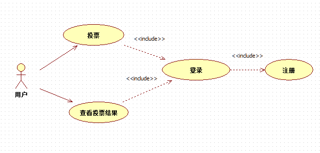
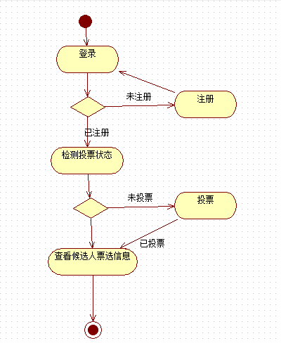
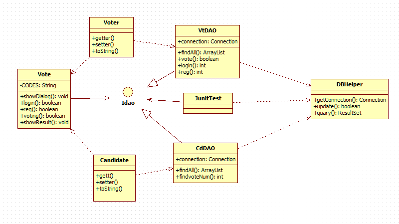

# Java中期测试项目汇报

## 总体介绍

* 本次Java中期测试我选择开发了统计投票器系统
* 整体交互界面在Java控制台中，利用MySQL数据库存储程序运行所需要的数据
* 本投票系统增加了用户注册、登录功能，每个用户仅能为一个候选人投票

## 功能描述

* 用户注册：每个用户初次进入系统可注册，输入用户名和两次输入相同密码即注册成功，但用户名是用户唯一标识，不能重复
* 用户登录：用户可用自己注册的用户名密码登录，登录前需输入验证码
* 投票：用户登录成功后，如已经投过票，则会显示投票结果，未投票可选择候选人id进行投票
* 查看投票结果：用户投票成功后可查看投票结果
* 该系统用例图如下：

  

## 系统流程图

* 用户首先选择注册，注册成功后可登录投票系统，登录系统后根据候选人信息投票，然后查看投票结果，最后退出系统

  

## 技术点应用说明

* 系统实现类图

  

* 本系统建立`Idao接口`将逻辑处理与数据分开

  ```java
  package com.gsafety.dao;

  import java.util.ArrayList;

  public interface Idao {
    public ArrayList findAll();
  }
  ```

* 采用正则表达式，注册密码重复输入等判断保证用户操作合法

  ```java
  while (!str.matches("[0-2]+")){
    System.out.println("输入格式不正确！重新输入：");
    str = br.readLine();
  }
  ```

  ```java
  if (!pwd.equals(pwd2)){
    System.out.println("两次输入密码不一致！重新注册！");
    reg();
  }
  ```

* 加入登录验证码程序，保证用户频繁登录操作

  ```java
  Random random = new Random();
    char[] codes = new char[4];
    for (int i = 0; i < 4; i++) {
      codes[i] = CODES.charAt(random.nextInt(CODES.length()));
    }
    String str = new String(codes);
    System.out.println("请输入验证码："+str);
    String str1 = br.readLine();
    while (!str1.equalsIgnoreCase(str)){
      System.out.println("验证码错误，请输入验证码："+str);
      str1 = br.readLine();
  }
  ```

* 采用Junit对开发过程不断测试，保证系统正常运行

  ```java
  @Test
  public void testFindAll(){
      CdDAO cdDAO = new CdDAO();
      try {
          ArrayList list = cdDAO.findAll();
          for (int i = 0; i < list.size(); i++) {
             System.out.println(list.get(i).toString());
          }
        } catch (Exception e) {
            e.printStackTrace();
        }
  }
  ```

* 将数据库操作封装成一个通用方法，便于数据的增删改查，`Object...参数`实现可扩展操作

  ```java
  package com.gsafety.util;

  import java.sql.*;

  public class DBHelper {

    /**
     * 对数据库执行增、删、改操作
     * @param connection 数据库连接对象
     * @param sql 数据库操作语句
     * @param params 执行对象
     * @return 查询结果
     */
    public static boolean update(Connection connection, String sql,Object... params){

        try{
            PreparedStatement ps = connection.prepareStatement(sql);
            for(int i = 0;i < params.length;i++){
                ps.setObject(i + 1, params[i]);
            }
            int rows = ps.executeUpdate();
            return rows > 0;
        }catch(SQLException ex){
            ex.printStackTrace();
        }
        return false;
    }

    /**
     * 对数据库执行查询操作
     * @param connection 数据库连接对象
     * @param sql 数据库操作语句
     * @param params 执行对象
     * @return 数据结果集
     */
    public static ResultSet query(Connection connection,String sql,Object... params){

        try{
            PreparedStatement ps = connection.prepareStatement(sql);
            for(int i = 0;i < params.length;i++){
                ps.setObject(i + 1, params[i]);
            }
            ResultSet rs = ps.executeQuery();
            return rs;
        }catch(SQLException ex){
            ex.printStackTrace();
        }
        return null;
    }
  }
  ```