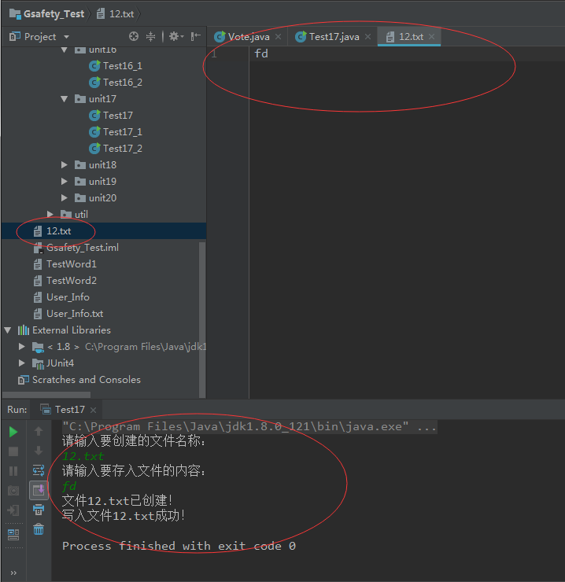
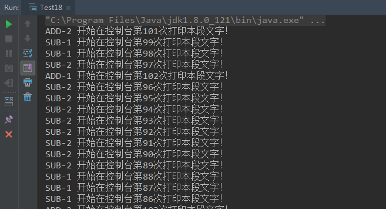

# 0515学习日志

## 第十七章增补练习

* 实现控制台输入文件名称以及文件内容，储存文件

  * 关键代码

  ```java
  package com.gsafety.test.unit17;

  import java.io.*;

  public class Test17 {

    //将文字写入文件
    public static boolean strToFile(String str, File f){
        if (f.exists()){
            f.delete();
            System.out.println("存在的文件"+f.getName()+"已删除！");
        }
        try {
            f.createNewFile();
            System.out.println("文件"+f.getName()+"已创建！");
        } catch (IOException e) {
            e.printStackTrace();
        }
        try {
            FileWriter fw = new FileWriter(f);
            fw.write(str);
            fw.close();
            System.out.println("写入文件"+f.getName()+"成功！");
            return true;
        } catch (IOException e) {
            e.printStackTrace();
        }
        return false;
    }

    public static void main(String[] args) {
        BufferedReader br= new BufferedReader(new InputStreamReader(System.in));
        System.out.println("请输入要创建的文件名称：");
        try {
            String str = br.readLine();
            File file = new File(str);
            while (file.exists()){
                System.out.println("已存在该文件，请重新输入名称：");
                str = br.readLine();
                file = new File(str);
            }
            System.out.println("请输入要存入文件的内容：");
            str=br.readLine();
            Test17.strToFile(str, file);
        } catch (IOException e) {
            e.printStackTrace();
        }
    }
  }
  ```

  * 运行截图

  

## 第十八章增补练习

* 实现四个线程对象、两个做加法、两个做减法

  * 关键代码（AddThread）

  ```java
  package com.gsafety.test.unit18;

  public class AddThread implements Runnable {

    private static int count;

    public AddThread(int count) {
        this.count = count;
    }

    @Override
    public void run() {
        while (true){
            synchronized ("") {
               count++;
               System.out.println(Thread.currentThread().getName()+" 开始在控制台第" + count + "次打印本段文字！");
               try {
                   Thread.sleep(2000);
               } catch (InterruptedException e) {
                   e.printStackTrace();
               }

            }
        }
    }
  }
  ```

  * 关键代码（SubThread）

  ```java
  package com.gsafety.test.unit18;

  public class SubThread implements Runnable{
    private static int count;

    public SubThread(int count) {
        this.count = count;
    }

    @Override
    public void run() {
        while (true){
            synchronized ("") {
                count--;
                System.out.println(Thread.currentThread().getName()+" 开始在控制台第" + count + "次打印本段文字！");
                try {
                    Thread.sleep(1000);
                } catch (InterruptedException e) {
                    e.printStackTrace();
                }

            }
        }
    }
  }
  ```

  * 关键代码（实现类）

  ```java
  package com.gsafety.test.unit18;

  public class Test18 {
    private static int count = 100;
    public static void main(String[] args) {
        Thread thread1 = new Thread(new AddThread(count),"ADD-1");
        Thread thread2 = new Thread(new SubThread(count),"SUB-1");
        Thread thread3 = new Thread(new AddThread(count),"ADD-2");
        Thread thread4 = new Thread(new SubThread(count),"SUB-2");

        thread1.start();
        thread2.start();
        thread3.start();
        thread4.start();
    }
  }
  ```

  * 运行截图

  

## 小结

>* 在文件创建中，首先判断文件是否存在，防止用户覆盖旧的文件
>* 多线程加减法中，两个线程都采用实现`Runnable接口`,与`继承Thread类`不同的是四个线程都可以利用到资源
>* 两个加法对象和两个减法对象没有共享到`静态变量count`的数值，有待思考？