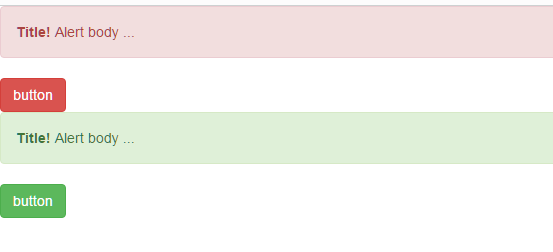

# 0520学习日志

## 制作Web前端学习计划表

* 学习计划表是完成任务的里程碑标识，对学习起到关键作用
* 对JavaSE的学习进行阶段性总结
* [点击查看Web学习计划表](Web学习计划.md)

## 配置VScode前端开发插件环境

* 通过同事分享以及网上博客学习，了解到几种VScode开发前端需要用到的工具
* 具体开发插件有：
  * 前端开发插件：`HTMLCSSSupport`/`HTMLBoilerplate`/`ViewInBroswer`
  * 代码辅助插件：`Prettier代码格式化`/`IconFonts图标辅助`/`ColorInfo色彩预览`/`CSSPeek代码定位`/`Beautify代码美化`

* 这些插件暂时做了一下测试和了解，希望能找到更多好的插件分享

## bootstrap开发框架学习

* bootstrap学习网址
  * 前往bootstrap官网下载bootstrapV3版本：[bootstrap下载](https://v3.bootcss.com/getting-started/#download)
  * 官方网站：[bootstrap中文网址](http://www.bootcss.com/)
  * 编码规范：[bootstrap编码规范](http://codeguide.bootcss.com/)

* bootstrap测试
  * 通过官网介绍，下载bootstrap包后解压到工程文件夹，并在html文档中采用下列导入代码

  ```html
  <!-- 最新版本的 Bootstrap 核心 CSS 文件 -->
  <link rel="stylesheet" href="https://cdn.bootcss.com/bootstrap/3.3.7/css/bootstrap.min.css" integrity="sha384-BVYiiSIFeK1dGmJRAkycuHAHRg32OmUcww7on3RYdg4Va+PmSTsz/K68vbdEjh4u" crossorigin="anonymous">

  <!-- 可选的 Bootstrap 主题文件（一般不用引入） -->
  <link rel="stylesheet" href="https://cdn.bootcss.com/bootstrap/3.3.7/css/bootstrap-theme.min.css" integrity="sha384-rHyoN1iRsVXV4nD0JutlnGaslCJuC7uwjduW9SVrLvRYooPp2bWYgmgJQIXwl/Sp" crossorigin="anonymous">

  <!-- 最新的 Bootstrap 核心 JavaScript 文件 -->
  <script src="https://cdn.bootcss.com/bootstrap/3.3.7/js/bootstrap.min.js" integrity="sha384-Tc5IQib027qvyjSMfHjOMaLkfuWVxZxUPnCJA7l2mCWNIpG9mGCD8wGNIcPD7Txa" crossorigin="anonymous"></script>
  ```

  * 通过导入后测试网页

  ```html
  <div class="alert alert-danger">
      <button type="button" class="close" data-dismiss="alert" aria-hidden="true">&times;</button>
      <strong>Title!</strong> Alert body ...
  </div>
  <div>
      <button type="button" class="btn btn-danger">button</button>
  </div>
  <div class="alert alert-success">
      <button type="button" class="close" data-dismiss="alert" aria-hidden="true">&times;</button>
      <strong>Title!</strong> Alert body ...
  </div>
  <div>
      <button type="button" class="btn btn-success">button</button>
  </div>
  ```

   

* bootstrap3注意事项
  * 在导入bootstrap到html文件时，增加属性`integrity`和`crossorigin`，前者是验证文件完整性的sha加密码，后者则是引入跨域脚本的选项
